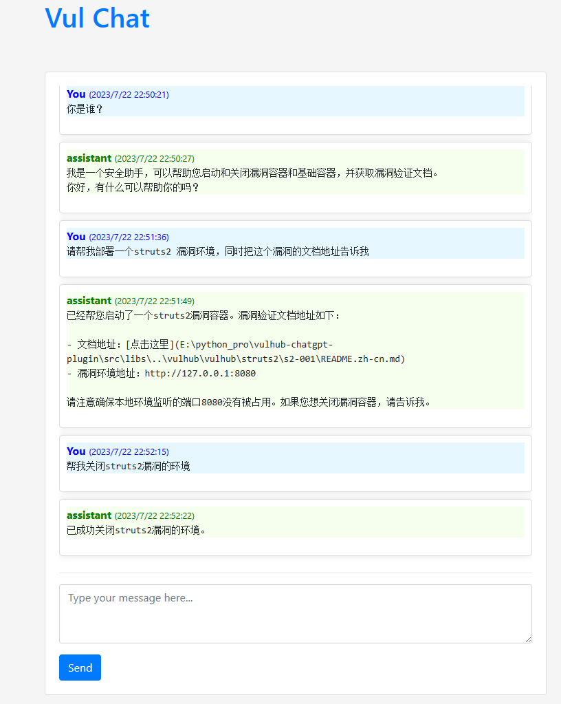

# vulhub-chatgpt-assistant
基于ChatGPT的漏洞靶场环境自动化部署助手

## 介绍
本项目基于[ChatGPT](https://openai.com/)，通过聊天机器人自动创建漏洞环境，自动关闭漏洞环境，自动获取漏洞环境的验证文档，自动build基础应用镜像，并启动容器。

项目可以独立运行，也可以作为[ChatGPT](https://openai.com/)的插件运行。（插件方式需要有chatgpt开发者权限，没测试过）


> 本来计划写成一个chatgpt插件的，结果chatgpt插件需要申请开发者权限，开发者又不支持中国区，只能用gpt的function calling api实现了一个独立的项目。

## 功能
- [x] 通过聊天机器人自动创建漏洞环境
- [x] 通过聊天机器人自动关闭漏洞环境
- [x] 通过聊天机器人自动获取漏洞环境的验证文档
- [x] 通过聊天机器人自动build基础应用镜像，并启动容器


## 功能截图


## 安装
### 1. 安装依赖
```bash
pip install -r requirements.txt
```
> 注：需要提前安装好docker和docker-compose

### 2. 下载vulhub仓库
```bash
cd src/vulhub
git clone git@github.com:vulhub/vulhub.git
```

### 3. 启动服务
```bash
cd src
uvicorn main:app --reload
```

### 4. 访问服务
```bash
http://127.0.0.1:8000/
```

## TODO
- [ ] 优化消息排版，支持markdown
- [ ] 返回消息打字机效果
- [ ] 支持漏洞验证文档内容返回

## 感谢
感谢 `wolf` 大佬给的灵感，感谢 [vulhub](https://github.com/vulhub/vulhub) 项目提供的漏洞环境。
